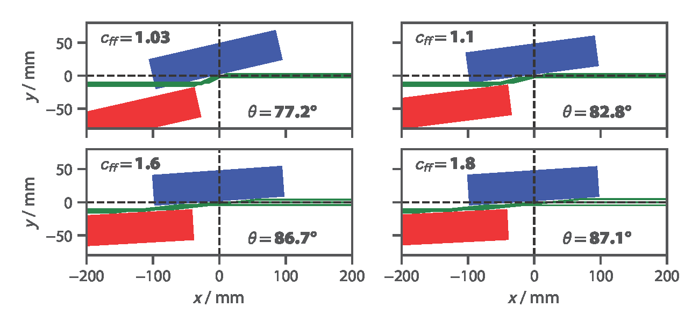

Welcome to PyPlaneMono's documentation!
=======================================

.. toctree::

   :maxdepth: 2
   :caption: Contents:
   tutorial
   installation
============
Introduction
============

Welcome to PyPlaneMono's documentation! PyPlaneMono is a python package written to simulate 
the geometry of plane grating monochromators (PGM), colloquiually known as plane monos. 
The PGM is an important component in all settings of synchrotron and FEL radiation in the soft X-ray range.

PyPlaneMono offers the following features:

* Fully simulate the geometry of any arbitrary PGM 
* Visualise PGM geometry (side view and top view) with matplotlib
* Interact with SHADOW [1]_ to simulate soft X-ray beamlines

This code was developed by Patrick Wang at the Diamond Light Source Optics and Metrology Group,
with significant input from Dr Andrew Walters and Murilo Bazan da Silva.

We recommend you read the tutorial to get started with PyPlaneMono.

There is now also a new version of an online GUI for PyPlaneMono, which can be found `here <https://pgmweb.diamond.ac.uk>`_.

We are always happy to hear feedback and suggestions. Please contact us at:
patrick.wang@diamond.ac.uk

.. [1] Sanchez del Rio, M., Canestrari, N., Jiang, F. & Cerrina, F. (2011). J. Synchrotron Rad. 18, 708-716.

Indices and tables
==================

* :ref:`genindex`
* :ref:`modindex`
* :ref:`search`
